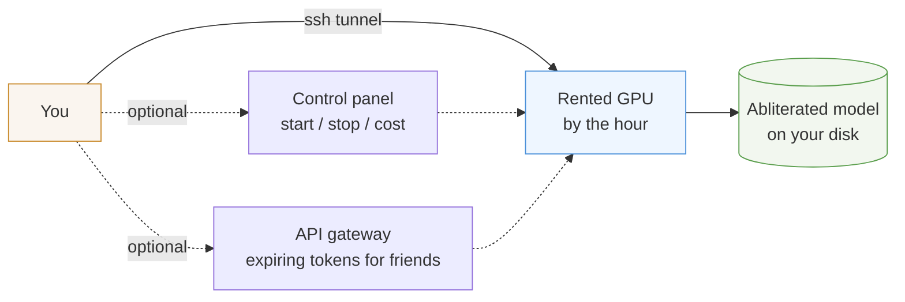

# ABLITERATED.cloud

**Intelligence, freed.**

Run an uncensored AI model on a GPU you rent by the hour. No account with us,
no API key from us, no content filter, no logs but your own. About **$0.60 an
hour** while it runs, and nothing when it doesn't.

This repository is the complete recipe: scripts to rent the GPU, a gateway to
share access safely, and honest notes about what actually works.

```sh
git clone https://github.com/eminogrande/ai-uncensored-abliterated-cloud
cd ai-uncensored-abliterated-cloud
export VAST_API_KEY=...        # from cloud.vast.ai/account
./scripts/rent-gpu.sh          # pick a GPU, confirm the price
./scripts/setup-model.sh <ID>  # build llama.cpp, fetch the model
./scripts/gpu.sh serve <ID>    # start the server
./scripts/gpu.sh tunnel <ID>   # chat at http://127.0.0.1:8080
```

Ten minutes from clone to your own private model. Stop it with
`./scripts/gpu.sh stop <ID>` and the billing stops with it.

## Why do this

Hosted models refuse. Sometimes for good reason, often for no reason you can
predict: a security question, a medical question, a piece of fiction, a word
that pattern-matched badly. You cannot appeal it and you cannot see the rule.

An **abliterated** model has had its refusal direction removed from the
weights. It answers. It is not a jailbreak prompt that stops working next
week, and it is not a model trained to be harmful - the knowledge is the same,
the reflex to decline is gone.

Running it yourself means:

- **Your prompts stay yours.** They go to a GPU you rented, through a tunnel
  only you hold the key to.
- **No rate limits, no revocation.** The card is yours for the hour.
- **You pick the model.** Swap one line, run a different one.
- **You see the whole bill.** Per hour, per gigabyte, no bundled mystery.

## What it costs

Real marketplace quotes, checked 2026-09-15. Prices move; these are the shape.

| What you want | Card | Per hour | Per month if never stopped |
| --- | --- | ---: | ---: |
| Chat + everyday code, 27B model | RTX 3090 24 GB | $0.17 | $125 |
| Roomier, faster, 27B at Q6 | A100 40 GB | $0.63 | $456 |
| Big model, 176B, huge context | RTX PRO 6000 96 GB | $1.28 | $922 |

Most people never pay the monthly number. Two hours a day on the 3090 is about
**$14 a month**, plus a few dollars for the disk that keeps your model between
sessions. The scripts stop the GPU when you tell them to; nothing runs behind
your back.

**Three things that cost people money.** A stopped instance is
still billed while stopped for its disk (cents a day, not free). There is no
automatic idle shutdown, so a forgotten GPU bills all night. And `destroy`
deletes your disk while `stop` keeps it — the scripts here only ever stop.

<details>
<summary>Our own instance, exactly — generated from the provider quote</summary>

<!-- RUNNING-COSTS -->
| Usage | Cost |
| --- | ---: |
| Running: GPU + disk / hour | **$0.63333** |
| Running continuously / 24 hours | **$15.20** |
| Running continuously / 30 days | **$456.00** |
| Stopped: retained disk / 30 days | **$24.00** |
| 2 hours running per day / 30 days, disk retained throughout | **$60.00** |

USD, contract quote checked 2026-09-05. GPU $0.60/hour plus storage $0.03333/hour. Stopped disk: $0.80/day. Two hours/day for 30 days: $36.00 GPU + $24.00 disk. GPU time is billed while running, even without requests. Storage is billed continuously. Bandwidth, applicable taxes and other services are excluded. No automatic idle shutdown.
<!-- /RUNNING-COSTS -->

</details>

## What you get



**The scripts** ([`scripts/`](scripts/)) are the whole product. Everything else
is optional.

| Command | What it does |
| --- | --- |
| `./scripts/rent-gpu.sh` | finds the cheapest card that fits, shows the price, asks before charging |
| `./scripts/rent-gpu.sh --big` | same, but a 96 GB card for the 176B model |
| `./scripts/setup-model.sh <ID>` | builds llama.cpp, downloads the model, re-runnable |
| `./scripts/gpu.sh status <ID>` | state and what it is costing right now |
| `./scripts/gpu.sh start\|stop <ID>` | start and stop; stop always keeps your disk |
| `./scripts/gpu.sh serve <ID>` | launches the model server with the right flags |
| `./scripts/gpu.sh tunnel <ID>` | opens `http://127.0.0.1:8080` on your machine |

**The control panel** ([`gateway/control.py`](gateway/control.py)) is a small
password-protected page for starting and stopping without a terminal, showing
live state and cost. Handy on a phone.

```sh
export ABL_VAST_KEY=...   ABL_INSTANCE=<your-id>
export ABL_PANEL_HASH=$(python3 -c "import hashlib,getpass;print(hashlib.sha256(getpass.getpass().encode()).hexdigest())")
python3 gateway/control.py serve     # http://127.0.0.1:8099
```

**The API gateway** ([`gateway/gateway.py`](gateway/gateway.py)) puts an
OpenAI-compatible endpoint in front of your model with bearer tokens that
expire on their own - so you can hand a friend a 24-hour token instead of SSH
access. See [API docs](docs/API.md).

Both are stdlib-only Python. No dependencies, no build step, no framework.

## Which model

| Model | Size | Refusals (publisher) | Coding evidence |
| --- | --- | --- | --- |
| [OBLITERATUS/Qwen3.8-27B-OBLITERATED](https://huggingface.co/OBLITERATUS/Qwen3.8-27B-OBLITERATED) | 22 GB | 20/20 probes passed | none published |
| [0bserverx/…Heretic-Abliterated](https://huggingface.co/0bserverx/Qwen3.8-27B-Heretic-Abliterated-Uncensored-GGUF) | 15 GB | 0-1 of 100 | none published |
| [apetersson/Qwen3.8-Flash-Next-Abliterated](https://huggingface.co/apetersson/Qwen3.8-Flash-Next-Abliterated) | 184 GB | 0 of 6 sentinels | 10/12 HumanEval+ after edit |
| [OS-Software/…Heretic-v3](https://huggingface.co/OS-Software/Qwen3.8-27B-Uncensored-Heretic-v3) | 25 GB | 0 of 100 | none published |

The default is the 27B OBLITERATED build: it fits a cheap card and it is the
one we have actually run. **Those refusal numbers are publisher claims**, not
our measurements, and none of them say anything about coding quality.

We ran our own 12-prompt probe on identical hardware. OBLITERATED came out
cleanest at 0 of 12, but on the two most extreme prompts it lectured instead of
answering - a keyword counter scores that as a pass; a human would not.
[The full table and the caveats](docs/STATUS.md#12-prompt-refusal-probe-2026-09-13)
are published, including the run that made a model look perfect by returning
nothing at all.

## Documentation

- **[Self-hosting guide](docs/SELFHOST.md)** - the ten-minute path, in detail,
  with the `--reasoning off` trap that silently freezes every streaming client.
- [Control panel](docs/CONTROL-PANEL.md) - start and stop from a browser.
- [API access](docs/API.md) - expiring tokens, revocation, client setup.
- [Status and evidence](docs/STATUS.md) - what we measured, what we did not.
- [Operations](docs/OPERATIONS.md) - the owner-account procedure.
- [Licensing](docs/LICENSING.md) - our MIT code versus upstream model terms.
- [Field notes and model news](https://abliterated.cloud/blog/)

## Honest limits

- **No universal zero-refusal guarantee.** Small probes cannot prove a general
  property. Anyone selling you one is guessing.
- **No validated 262k workload.** A configured context length is a setting, not
  proof that quality holds across it. Our probe ran at 16k.
- **Abliteration removes refusals, it does not add ability.** A model that
  stops declining is not suddenly a better coder. Published capability numbers
  usually come from the *base* model, before the edit.
- **Restarting a stopped GPU can fail.** The card goes back to the marketplace
  when you stop; getting one back competes with everyone else. We have had a
  start request sit unavailable for twenty minutes.
- **Small models make poor agents.** A 27B model behind a tool-calling loop
  stalls and invents tool calls far more than a frontier model. Excellent as
  chat and completion; test one bounded task before trusting a long loop.
- **This is not a hosted service.** There is no public endpoint, no signup and
  no billing here. You rent your own GPU with your own account. Our own
  operating path is **Vast.ai + llama.cpp** over a private SSH tunnel; the
  retired Modal implementation is kept in [archive/modal/README.md](archive/modal/README.md)
  as history, not as instructions.

## Contributing

Issues and pull requests are welcome, especially: cold-start timings on cards
we have not tried, coding benchmarks on abliterated builds (the gap nobody has
filled), and scripts for other GPU marketplaces.

Corrections to our numbers are the most valuable contribution of all. Every
claim here should be checkable; if one is not, that is a bug.

## Work on the website

```sh
uv sync --group dev
uv run python -I scripts/build-blog.py
uv run pytest -q
python3 -m http.server 8788 --bind 127.0.0.1 --directory website
```

Reading the site needs no GPU, no inference call and no external font service.
See the [website guide](website/README.md).

## License

Our code, docs and website are [MIT](LICENSE). Model weights, llama.cpp and
every dependency keep their own upstream licenses - see
[licensing scope](docs/LICENSING.md). Earlier Apache-2.0 releases keep their
terms; the [changelog](CHANGELOG.md) has the history.

Use this, fork it, sell services with it. Just do not promise a zero-refusal
guarantee you cannot prove.
