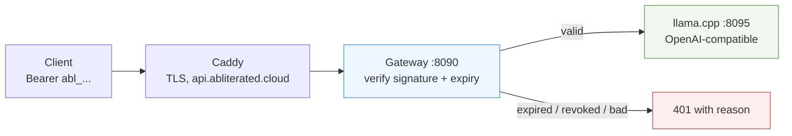

# API access — api.abliterated.cloud

An OpenAI-compatible endpoint in front of our self-hosted abliterated model,
protected by bearer tokens that can expire. Anything that speaks the OpenAI API
works: Cline, Open WebUI, OpenCode, the `openai` SDK, plain `curl`.

```
Base URL:  https://api.abliterated.cloud/v1
Auth:      Authorization: Bearer abl_...
```

**Backend state:** the gateway is live with TLS and token auth. The model
backend behind it is **off** unless a GPU session is running — calls return
`502 upstream unavailable` when no GPU is up. That is expected, not a bug.
See [status](STATUS.md) for the current instance state.

## Quick start

```sh
curl https://api.abliterated.cloud/v1/chat/completions \
  -H "Authorization: Bearer $ABLITERATED_API_KEY" \
  -H 'Content-Type: application/json' \
  -d '{
    "model": "qwen3.8-27b-abliterated",
    "stream": true,
    "messages": [{"role": "user", "content": "Write a Python function that sorts a list."}]
  }'
```

Python, unchanged from any OpenAI example:

```python
from openai import OpenAI

client = OpenAI(
    base_url="https://api.abliterated.cloud/v1",
    api_key="abl_...",
)
print(client.chat.completions.create(
    model="qwen3.8-27b-abliterated",
    messages=[{"role": "user", "content": "hi"}],
).choices[0].message.content)
```

## How the tokens work



A token is `abl_<payload>.<hmac-sha256>`. The payload carries a token id, an
expiry timestamp and a label. The signature is checked against a server-side
secret, so a token cannot be forged or its expiry edited. Every token is also
recorded in SQLite, which is what makes revocation and usage counts possible.

| Property | Behaviour |
| --- | --- |
| Expiry | enforced server-side from the signed payload; `null` = never expires |
| Revocation | instant, by token id prefix, independent of expiry |
| Tampering | any edit breaks the HMAC → `401 bad signature` |
| Usage tracking | call count and last-used timestamp per token |
| Scope | one shared model; tokens do not carry per-model permissions |

## Issuing tokens (operator)

All commands run on the gateway host:

```sh
ssh root@46.225.27.102
cd /opt/abliterated
export ABL_DB=/opt/abliterated/tokens.db ABL_SECRET=/opt/abliterated/secret.key
```

**24-hour token for a tester:**

```sh
python3 gateway.py mint alice-test 24
# abl_<payload>.<signature>
```

**Any other window** — the number is hours:

```sh
python3 gateway.py mint demo-2h 2        # 2 hours
python3 gateway.py mint weekend 72       # 3 days
python3 gateway.py mint owner never      # no expiry
```

**See what is out there:**

```sh
python3 gateway.py list
# 757c726b  testers-batch1   24.0h left   calls=3   last=2026-09-15 16:41
# d5e197cd  emin-owner       never expires calls=12  last=2026-09-15 16:55
```

**Kill a token early** (first 8 characters of the id from `list`):

```sh
python3 gateway.py revoke 757c726b
```

Expired and revoked tokens both fail closed with an explicit reason, so a
tester can tell "my token ran out" from "the service is down".

## Sharing a token with testers

Send them the base URL, the token and one working command. They need nothing
else — no account, no signup, no key of their own:

> Base URL: `https://api.abliterated.cloud/v1`
> Token: `abl_...` (expires in 24 hours)
> ```sh
> curl https://api.abliterated.cloud/v1/chat/completions \
>   -H "Authorization: Bearer abl_..." \
>   -H 'Content-Type: application/json' \
>   -d '{"model":"qwen3.8-27b-abliterated","messages":[{"role":"user","content":"hi"}]}'
> ```

Tokens are bearer credentials: whoever holds one can use the endpoint until it
expires or is revoked. Issue short windows for people you do not know, and
revoke rather than wait when a token leaks.

## Client configuration

| Client | Where | Value |
| --- | --- | --- |
| **Cline** | OpenAI-compatible provider | base `https://api.abliterated.cloud/v1`, key `abl_...` |
| **Open WebUI** | Admin → Connections → OpenAI | same base and key |
| **OpenCode / Pi** | custom provider `baseURL` | `https://api.abliterated.cloud/v1` |
| **Hermes** | `providers.abliterated` | already wired; key in `ABLITERATED_API_KEY` |
| **openai SDK** | `base_url` | `https://api.abliterated.cloud/v1` |

## Operating the gateway

```sh
systemctl status abliterated-gateway     # service state
systemctl restart abliterated-gateway    # after a config change
journalctl -u abliterated-gateway -f     # live log, no token material
```

The gateway listens on `127.0.0.1:8090` and is reachable only through Caddy,
which terminates TLS for `api.abliterated.cloud`. It proxies to
`http://127.0.0.1:8095` — point an SSH tunnel from the GPU box at that port to
put a model behind it:

```sh
# on the gateway host, forward the GPU's llama.cpp to the local upstream port
ssh -N -L 127.0.0.1:8095:127.0.0.1:8080 -p <GPU_SSH_PORT> root@<GPU_HOST>
```

`/health` is intentionally public so uptime checks need no credential. Every
`/v1/*` path requires a token.

## Security boundaries

- The signing secret lives at `/opt/abliterated/secret.key`, mode 600.
  **Replacing it invalidates every existing token at once** — that is the
  emergency stop if the registry is ever in doubt.
- Tokens are never written to logs. `journalctl` shows request lines only.
- There is no rate limiting and no per-token quota. A shared token is a shared
  GPU; issue separate tokens so you can revoke individually.
- This is a private endpoint for testing, not a commercial API: no billing, no
  SLA, no multi-tenancy isolation beyond the token check.
