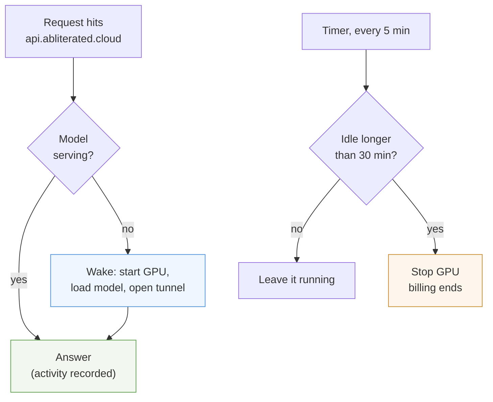

# Autopilot: wake on demand, stop when idle

The GPU starts itself when a request arrives and stops itself after 30 minutes
of silence. You never pay for an idle GPU, and you never start one by hand.



## What it costs

| Pattern | Without autopilot | With autopilot |
| --- | ---: | ---: |
| A100 left running all month | $456 | — |
| 4 hours of real use per day | $456 | **$96** |
| 1 hour of real use per day | $456 | **$43** |
| Nothing used all month | $456 | **$24** (disk only) |

The disk keeps costing while stopped — that is what makes waking fast, because
the model never re-downloads.

## Timing, honestly

| Step | Time |
| --- | --- |
| First request wakes the GPU | **2–4 minutes** before the first token |
| Later requests, GPU already up | instant |
| Stop after last request | up to 35 minutes (30 idle + 5 timer) |

**The first request after a sleep is slow.** Boot takes 1–3 minutes, loading a
22 GB model into VRAM about another minute. Clients with a short timeout may
give up; send one throwaway request to wake it, then work normally.

**Waking can fail.** A stopped instance releases its GPU back to the
marketplace. If no identical card is free, the start request waits — we have
seen twenty minutes with no success. Autopilot gives up after 15 minutes and
returns an error rather than hanging forever.

## Setup

On the machine running the API gateway:

```sh
cat > /opt/abliterated/autopilot.env <<'EOF'
ABL_VAST_KEY=...
ABL_INSTANCE=49433042
ABL_IDLE_MINUTES=30
ABL_STATE=/opt/abliterated
ABL_LOCAL_PORT=8095
ABL_SSH_KEY=/root/.ssh/id_ed25519
EOF
chmod 600 /opt/abliterated/autopilot.env
```

The key in `ABL_SSH_KEY` must be registered with Vast
(`vastai create ssh-key "$(cat ~/.ssh/id_ed25519.pub)"`) so the gateway host can
reach the GPU to launch the server.

Install the timer:

```sh
systemctl enable --now abliterated-reaper.timer   # checks every 5 minutes
systemctl restart abliterated-gateway             # picks up ABL_AUTOPILOT
```

Wake-on-request is enabled by setting `ABL_AUTOPILOT` on the gateway service.
Leave it unset and the gateway behaves exactly as before — no waking, no
stopping.

## Checking on it

```sh
python3 /opt/abliterated/autopilot.py status
# {"state": "running", "serving": true, "idle_minutes": 3.2,
#  "stops_in_minutes": 26.8, "cost_per_hour": 0.6333}

journalctl -u abliterated-reaper.service -n 20   # what the timer decided
tail -f /opt/abliterated/autopilot.log           # wake and stop events
```

Manual override any time:

```sh
python3 /opt/abliterated/autopilot.py wake   # start now, do not wait
python3 /opt/abliterated/autopilot.py reap   # stop now if idle
```

## Tuning the idle window

`ABL_IDLE_MINUTES` is the trade-off between money and waiting:

| Value | Good for |
| --- | --- |
| `10` | occasional questions, you do not mind waiting again |
| `30` | default: survives a coffee break, still cheap |
| `120` | a working session where a 3-minute wake would break flow |

The timer checks every 5 minutes, so actual stop time is the window plus up to
5 minutes.

## Safety properties

These are covered by tests in `tests/test_autopilot.py`:

- **A GPU in use is never stopped.** 29 minutes idle stays up; 31 stops.
- **A wake in progress is never reaped.** A lock file blocks the reaper, so a
  paid boot is never stranded halfway.
- **Concurrent requests do not stack.** Two simultaneous wakes result in one
  boot; the second waits.
- **No duplicate stops.** An already-stopped instance is left alone.
- **Autopilot cannot destroy anything.** It only ever sends `running` or
  `stopped`. Deleting a disk remains a manual action in the Vast console.
