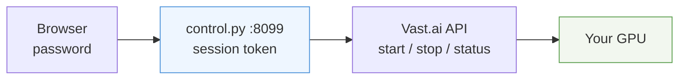

# Control panel

A password-protected page to start and stop your GPU without opening a
terminal. Live state, live cost, two buttons. Works on a phone.



## Run it

Everything comes from the environment — nothing is stored in the repo.

```sh
export ABL_VAST_KEY=...             # cloud.vast.ai/account
export ABL_INSTANCE=49433042        # your instance id
export ABL_PANEL_HASH=$(python3 -c \
  "import hashlib,getpass;print(hashlib.sha256(getpass.getpass().encode()).hexdigest())")

python3 gateway/control.py serve    # http://127.0.0.1:8099
```

The hash command prompts for a password and prints its SHA-256. Only the hash
is ever set as a variable; the password itself is never written down.

## Without a browser

The same actions, as a CLI:

```sh
python3 gateway/control.py status
# instance 49433042 (A100 PCIE): exited
#   intended:  stopped
#   disk:      120.0 GB
#   cost:      $0.6333/h running, $0.8/day stopped

python3 gateway/control.py start
python3 gateway/control.py stop
```

## Reaching it from your phone

The panel binds to `127.0.0.1` on purpose — it is not exposed to the internet.
To use it from a phone, forward it over SSH from wherever it runs:

```sh
ssh -N -L 8099:127.0.0.1:8099 you@your-server
```

If you want it on a real domain, put it behind a TLS reverse proxy the same way
[the API gateway](API.md) is, and keep the panel itself on loopback.

## What the numbers mean

| Field | Meaning |
| --- | --- |
| `running` | GPU is billing by the hour |
| `scheduling` | start requested, waiting for a free card — can take minutes or fail |
| `stopped` | GPU not billing; the disk still costs a little each day |
| Costing now | hourly rate while running, daily disk rate while stopped |

Starting is a request, not a promise: a stopped instance releases its GPU back
to the marketplace, and getting one back competes with everyone else.

## Security

- The password is compared as a SHA-256 digest with `hmac.compare_digest`, and
  failed logins pause briefly to make guessing tedious.
- Sessions are 32 random bytes, held in memory only, expiring after 8 hours.
  Restarting the panel logs everyone out.
- The Vast API key stays server-side. The browser only ever holds a session
  token, which can do exactly three things: read status, start, stop.
- There is no destroy action anywhere in the panel. Deleting an instance is
  deliberately something you can only do from the Vast console.
- Anyone with the password can spend your money by starting a GPU. Use a real
  password and do not expose the panel publicly without TLS.
