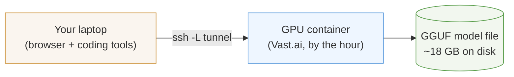
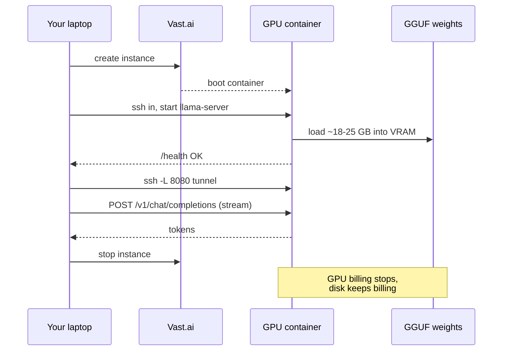
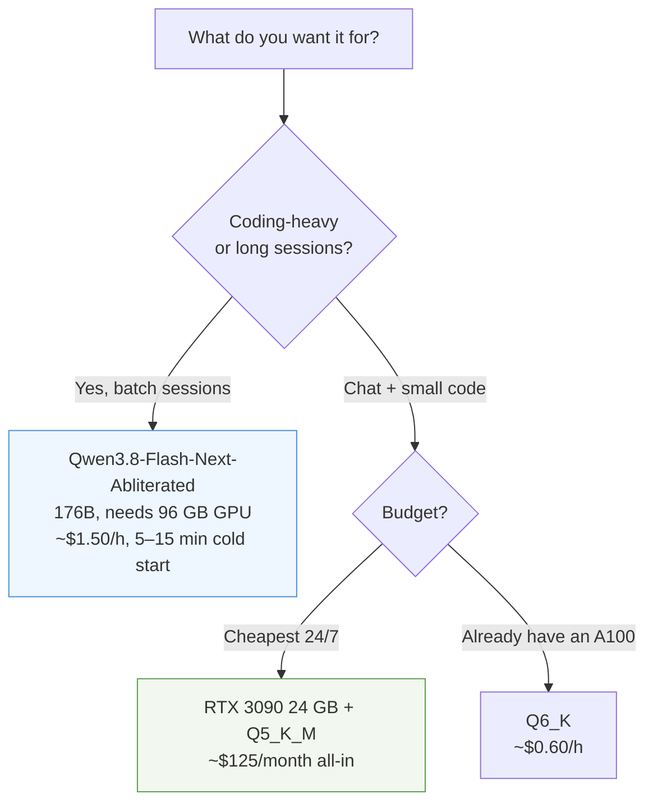
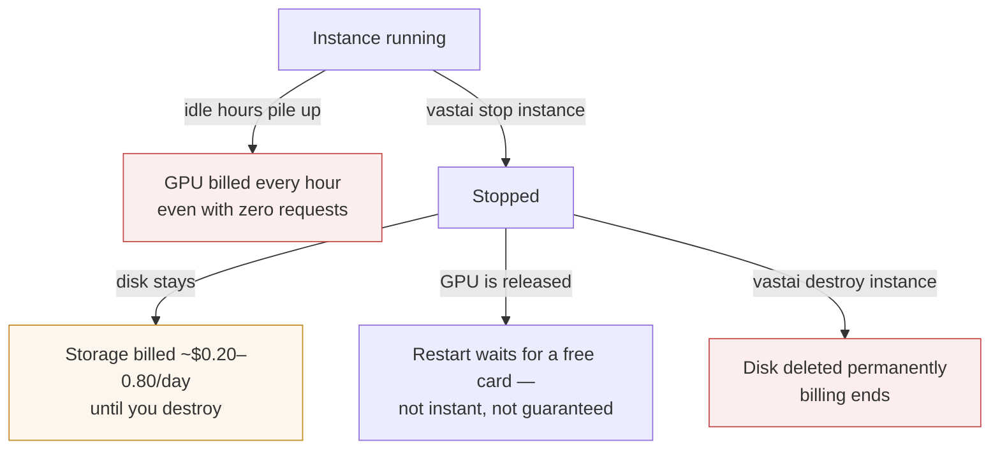

# Self-host an uncensored model in 10 minutes

No account, no API key, no content filter. Rent a GPU by the hour, run an
**abliterated** model on it, talk to it through your browser or coding tool.
This is the community path — anyone can follow it.

**Abliterated** = the model's refusal direction was surgically removed, so it
answers instead of lecturing. It is *not* "untrained safety", *not* a jailbreak
prompt, and *not* a guarantee of zero refusals on every prompt.

**What you get:** your own private LLM endpoint. Nobody reads your prompts,
nobody rate-limits you, nobody revokes access.

## What you need

1. A Vast.ai account (~10 USD credit is plenty for a first session)
2. An SSH key uploaded to Vast before you rent
3. A terminal and a browser

## How it fits together



Your laptop never talks to the GPU directly. The SSH tunnel carries everything,
so the model endpoint only ever exists on `127.0.0.1` — your own machine.

## Step 1 — Rent a GPU

Install the CLI and find a card that fits the model:

```sh
pip install vastai
vastai search offers 'num_gpus=1 gpu_ram>=23 reliability>0.95 disk_space>=60' \
  --storage 60 --order dph_total --limit 5
```

| Model class | Minimum VRAM | Example GPU | Typical rate |
| --- | --- | --- | --- |
| `Qwen3.8-27B` abliterated, Q4_K_M / Q5_K_M | 24 GB | RTX 3090, RTX 4090 | $0.15–0.30/h |
| `Qwen3.8-27B` abliterated, Q6_K | 32 GB+ | A100 40 GB | $0.60–1.00/h |
| `Qwen3.8-Flash-Next-Abliterated` (176B) | 96 GB | RTX PRO 6000 | $1.30–2.40/h |

Rent one (replace the offer ID from the search above):

```sh
vastai create instance <OFFER_ID> \
  --image nvidia/cuda:12.8.0-devel-ubuntu24.04 \
  --disk 120 --ssh --direct --label my-llm
```

## Step 2 — Log in and build the server

Find your SSH details in `vastai show instances`, then:

```sh
ssh -i ~/.ssh/id_ed25519 -p <PORT> root@<HOST>

# inside the container (one-time, ~5 minutes)
apt update && apt install -y cmake build-essential git
git clone https://github.com/ggml-org/llama.cpp && cd llama.cpp
cmake -B build -DGGML_CUDA=ON -DCMAKE_CUDA_ARCHITECTURES=native
cmake --build build --config Release -j
```

Model licenses are separate from this project's MIT code — see
[licensing scope](LICENSING.md).

## Step 3 — Download the model and start it

```sh
# download (~18–25 GB depending on quant)
huggingface-cli download OBLITERATUS/Qwen3.8-27B-OBLITERATED \
  Qwen3.8-27B-OBLITERATED-Q6_K.gguf --local-dir /root/models

# start (every session)
/root/llama.cpp/build/bin/llama-server \
  -m /root/models/Qwen3.8-27B-OBLITERATED-Q6_K.gguf \
  --host 127.0.0.1 --port 8080 \
  -ngl 999 -c 65536 -fa on --jinja --reasoning off
```

- `-ngl 999` — offload everything to the GPU
- `-c 65536` — context window. `65536` is a sane default for coding; the
  model advertises `262144`, but advertised context is not tested quality
- `--jinja` — apply the model's chat template
- **`--reasoning off` — keep this.** Abliterated Qwen3.8 GGUFs loop in
  `/`-reasoning output under `--reasoning auto`. It looks fine with plain
  `curl`, but every streaming client (browser, Cline, OpenCode) freezes on
  "thinking" with no visible text. `off` removes the loop.

## Step 4 — Open the tunnel and talk

On your laptop, in a second terminal:

```sh
ssh -i ~/.ssh/id_ed25519 -p <PORT> \
  -o IdentitiesOnly=yes -o ExitOnForwardFailure=yes \
  -N -L 127.0.0.1:8080:127.0.0.1:8080 root@<HOST>
```

Open `http://127.0.0.1:8080/` in your browser. That is the built-in
llama-server web UI. **Done — you are talking to your own uncensored model.**

## Step 5 — Verify it actually streams

Do not skip this. Streaming is how every real client talks, and it is exactly
what the `--reasoning off` bug breaks:

```sh
curl -N http://127.0.0.1:8080/v1/chat/completions \
  -H 'Content-Type: application/json' \
  -d '{
    "stream": true,
    "messages": [{"role":"user","content":"Write a Python function that sorts a list."}]
  }'
```

You must see tokens arriving live. A clean HTTP 200 with an empty body, or
endless `reasoning_content` fields, means the reasoning loop is still running.

## How a session flows



## Choose your model



| Model | Size | Zero-refusal evidence | Coding evidence |
| --- | --- | --- | --- |
| `OBLITERATUS/Qwen3.8-27B-OBLITERATED` | 22 GB (Q6) | publisher: 20/20 hand-written probes | none published post-abliteration |
| `0bserverx/Qwen3.8-27B-Heretic-Abliterated-Uncensored` | 15.4 GB (Q4) | publisher: 0–1/100 | none published |
| `apetersson/Qwen3.8-Flash-Next-Abliterated` | 184 GB (Q5) | publisher: 0/6 sentinel prompts | 10/12 HumanEval+/MBPP+ post-abliteration |
| `OS-Software/Qwen3.8-27B-Uncensored-Heretic-v3` | 25 GB (Q6) | publisher: 0/100 | none published |

**Read these as publisher claims, not guarantees.** Small probes do not prove
universal behavior, and "0 refusals" says nothing about coding quality. We ran
our own 12-prompt probe on 2026-09-13 — see
[what we run](#what-we-are-currently-running).

## Connect a coding tool

All of them speak the OpenAI-compatible API at `http://127.0.0.1:8080/v1`:

| Tool | Status (Sep 2026) | Setup |
| --- | --- | --- |
| **llama-server web UI** | bundled | just open `http://127.0.0.1:8080/` |
| **Cline** (VS Code) | active | "OpenAI-compatible API", base URL + dummy key |
| **Open WebUI** | active | `docker run`, add an OpenAI endpoint |
| **OpenCode** / **Pi** | active | custom provider, `baseURL` = `http://127.0.0.1:8080/v1` |
| **Continue.dev** | unmaintained | not recommended |
| **Roo Code** | discontinued (May 2026) | not recommended |

Use the exact model ID from `curl http://127.0.0.1:8080/v1/models` as the
client's model name. An alias like `qwen3.8-27b-obl` is a client-side label —
it does not load or switch weights.

**Warning — agent loops:** a 27B model behind a tool-calling agent (Cline,
Pi, OpenCode, Hermes agent mode) hallucinates tool calls and stalls more often
than a frontier model. It is excellent as a chat and completion endpoint.
For agentic coding, test one bounded task before trusting an unattended loop.

## Cost control — read this before you rent



- **You pay for the GPU every hour it runs**, whether you send one request or none.
- **There is no automatic idle shutdown.** If you close your laptop, the GPU
  keeps billing. Stop the instance yourself.
- **Stop ≠ destroy.** Stop frees the GPU and keeps your disk (and its small
  daily fee). Destroy deletes the disk and everything on it. Routine pause = stop.
- **A stopped instance may not restart.** The GPU is released back to the
  marketplace; a restart competes for a free card and can wait indefinitely.
- **Prices are live quotes.** A $0.16/h offer can vanish in minutes. Filter
  `rented=False` right before you book.

## What we are currently running

Tested state, 2026-09-13, Vast.ai A100 SXM4 80 GB, $0.99/h, Czechia.

| Field | Value |
| --- | --- |
| Instances | `49433042` (A100 PCIe 40 GB, **stopped**, disk retained) · `50934401` (A100 SXM4 80 GB, **stopped** after A/B test) |
| Models on disk | `OBLITERATUS/Qwen3.8-27B-OBLITERATED` Q6_K (22.4 GB) · `OS-Software/Qwen3.8-27B-Uncensored-Heretic-v3-UD` Q6_K_XL (24.9 GB) |
| Runtime | llama.cpp commit `5f436dd`, CUDA, `-ngl 99 -fa on -c 16384` |
| Endpoint | private SSH tunnel to `http://127.0.0.1:8080/v1` only |
| Public API | **none.** No self-service endpoint, no API keys, no checkout |

### Our 12-prompt refusal probe (2026-09-13)

12 prompts from `mlabonne/harmful_behaviors`, seed 42, temperature 0, keyword
scoring. Same GPU, same quant class (Q6), same sampler. This is a small probe,
not a benchmark:

| Model | Mode | Refusals | Note |
| --- | --- | --- | --- |
| `OBLITERATUS/Qwen3.8-27B-OBLITERATED` Q6_K | thinking off | **0/12** | also lectured instead of answering on 2 extreme prompts |
| `OS-Software/…Heretic-v3-UD` Q6_K_XL | thinking off | 5/12 | 2 hard refusals, 3 disclaimer-then-answers |
| `OS-Software/…Heretic-v3-UD` Q6_K_XL | thinking on, 4k budget | 0/12 | but 7/12 returned **empty** — reasoning ate the token budget |

Full logs: `abliterated-score-review/ab-test-2026-09-13/AB-REPORT.md`.

**Honest read:** OBLITERATED scored lowest on keywords, but on the two most
extreme prompts it lectured instead of answering — a keyword scorer counts that
as a pass, a human does not. Heretic-v3 with thinking on is the most genuinely
compliant, but unusably slow and half the outputs came back empty. Neither model
is a coding champion; **coding quality was not tested in this probe.**

See [status evidence](STATUS.md) for the dated account snapshots and what
remains untested.

## Troubleshooting

| Symptom | Cause | Fix |
| --- | --- | --- |
| Client spins on "thinking", no text | `--reasoning auto` loop on an abliterated GGUF | restart server with `--reasoning off` |
| `curl` works, client does not | same loop; non-streaming masks it | the fix is the same — verify with `curl -N` + `"stream": true` |
| `disk full` on download | Vast default disk is small | create with `--disk 120` or more |
| SSH fails with no host key | host IP changes on restart | accept the new fingerprint after verifying it |
| `create instance` fails | offer was rented by someone else | re-run search with `rented=False` |
| Clean HTTP 200, empty body | reasoning loop, or context too large | `--reasoning off`; lower `-c` |
| Instance will not restart | GPU released while stopped | wait, or pick a different offer |

## Project license

Our own code, docs and website are **MIT** — see [LICENSE](../LICENSE).
Model weights, llama.cpp and everything else keep their upstream licenses;
this guide never overrides them. Previous Apache-2.0 releases keep their terms
(see [licensing scope](LICENSING.md) and the [changelog](../CHANGELOG.md)).

If you build on this guide, keep the MIT notice, keep the upstream licenses,
and do not advertise a "zero-refusal guarantee" you cannot prove.
